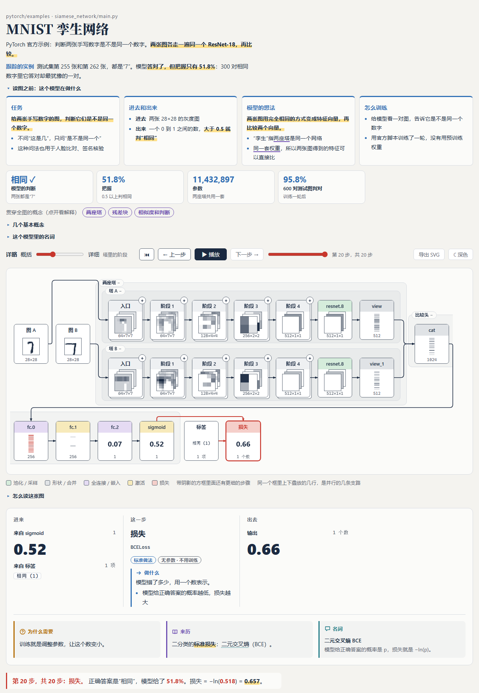
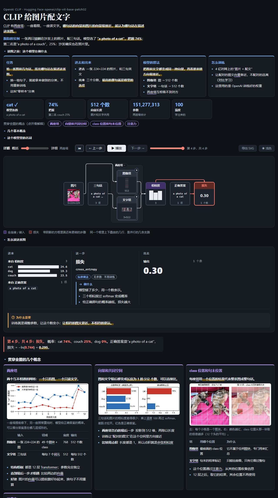

# model-flow

把一个机器学习 / 深度学习项目变成一张**能动的框架图**：一个独立的 HTML 页面，跟着一个真实样本从输入一路走到损失。

*A Claude skill that turns an ML/DL project into an interactive, paper-style framework diagram: one self-contained
HTML page that follows one real example from input to loss.*



## 它做什么

这是一个给 [Claude Code](https://claude.com/claude-code) 用的 skill（技能）。装好以后，在任何一个有模型的项目里说一句“给这个项目画框架图”，Claude 会：

1. 读项目的代码，找到模型、数据和损失；
2. 用项目自己的代码和权重，拿**一个真实样本**跑一遍前向和反向；
3. 把每一步的输出、形状、梯度和对应的源码行记下来；
4. 生成一个 HTML 页面，自己打开检查一遍连线，再交给你。

页面上有：

- **详略滑块**：最左边是“输入 → 模型 → 损失”，最右边是每一层。
- **真实数据**：每个方框里画的是这个样本在这一步变成了什么，不是示意图。
- **逐步播放**：播放、暂停、上一步、下一步；下方面板写明进来什么、出去什么、梯度多大。
- **写给初学者的说明**：每个方框都回答四个问题——做什么、为什么需要、来历（是固定计算、标准做法、知名结构还是项目自创）、有没有要训练的参数；用到的名词当场解释。
- **读图之前**：标题下面几张卡片讲清任务是什么、进去什么出来什么、模型的想法、怎么训练。
- **概念卡片**：好几个方框都提到的东西（比如“两座塔”“注意力”）单独一张卡片，配表格和用这个样本画的说明图，正文里提到它的地方都能点过去。
- **分支并排**：双塔、残差支路、注意力的 Q / K / V 画成上下并排的几行。
- **重复的块只展开第一个**（标 ×N），其余点“＋”再看。
- **浅色 / 深色**两种外观，**导出 SVG** 放进论文或幻灯片。

页面不引用任何外部脚本，一个文件可以直接发给别人。

## 安装

需要先装好 Claude Code。

**方式一：复制文件夹（推荐）**

```bash
git clone https://github.com/thisisme112/model-flow.git
```

然后把仓库里的 `model-flow/` 文件夹（里面有 `SKILL.md` 的那个）复制到技能目录。

macOS / Linux：

```bash
mkdir -p ~/.claude/skills && cp -r model-flow/model-flow ~/.claude/skills/
```

Windows PowerShell：

```powershell
New-Item -ItemType Directory -Force "$env:USERPROFILE\.claude\skills" | Out-Null; Copy-Item -Recurse model-flow\model-flow "$env:USERPROFILE\.claude\skills\"
```

只想在某一个项目里用，就复制到那个项目的 `.claude/skills/` 下面。

**方式二：打包成一个文件**

```bash
python pack.py
```

会生成 `dist/model-flow.skill`（一个 zip 包），可以在 Claude 应用的设置里作为技能上传，或者发给别人。

## 需要什么

| 东西 | 用来做什么 | 说明 |
|---|---|---|
| Python 3.9 以上和 `torch` | 跑模型、记录每一步 | 用项目自己的环境；缺什么 Claude 会先告诉你再装 |
| `matplotlib` | 画概念卡片和面板里的说明图 | 同上，缺了会装（约 35 MB） |
| 一个 Chromium 内核的浏览器（Chrome、Edge、Chromium、Brave） | 生成后自动检查连线、截图 | 没有也能用，只是少了自动检查 |
| 模型权重和一个样本 | 页面上的数都来自它们 | 项目里有就用项目的；需要下载时会先问你，说明名称、来源和大小 |

不需要 GPU：只跑一个样本，CPU 就够。

## 怎么用

在你的项目目录里打开 Claude Code，直接说，例如：

- “给这个项目画一张模型框架图”
- “这个模型是怎么工作的？画出来讲讲”
- “给论文画一张模型结构图”

或者输入 `/model-flow`。

Claude 会先用两三行告诉你它要画哪个模型、用哪个样本、文件放在哪。之后的产物都在项目里的 `model-flow/` 文件夹：

```
<你的项目>/model-flow/
  spec.py        生成页面数据的脚本（想换样本、改分组、改说明文字，改它）
  spec.json      它写出的数据
  <名字>.html    页面，双击就能打开
  shots/         每个详略级别的截图
```

它不会改你项目的源码，也不会改 `.gitignore`。

### 怎么看页面

1. 滑块先放在最左边，看整体。
2. 按一次“播放”：红色方框是数据现在所在的位置，颜色淡的是还没走到的。
3. 滑块一档一档往右拉，每一档多展开一层结构。
4. 点任何一个方框，下方面板显示这一步的输入、输出和梯度，以及它做什么、为什么需要、来历。
5. 正文里带下划线的词：虚线的停一下看解释，实线的点一下跳到它的概念卡片。
6. 键盘：← → 单步，空格播放 / 暂停。网址后面加 `#level-3` 可以直接打开第 3 档。

### 导出图片

先把滑块和各个模块的展开 / 收起调成你要的样子，把浏览器窗口拉到图需要的宽度，再点“导出 SVG”。导出的是白底矢量图，可以用 Inkscape、Illustrator、PowerPoint 打开，要 PDF 在这些软件里另存。

## 示例

`examples/` 里有六个已经生成好的页面，下载后双击 `.html` 就能看：

| 页面 | 项目 | 展示了什么 |
|---|---|---|
| `mnist.html` | pytorch/examples 的 MNIST | 普通 CNN；多一个滑块，看同一张图在训练一轮中五个时刻的结果 |
| `siamese.html` | pytorch/examples 的孪生网络 | 两座 ResNet-18 塔并排，下采样支路并排 |
| `gpt2.html` | Hugging Face `distilgpt2` | Transformer，注意力权重，每层之后“现在会接哪个词” |
| `clip.html` | Hugging Face `openai/clip-vit-base-patch32` | 图像塔和文字塔，Q / K / V 并排 |
| `resblock.html` | 一个残差块 | 最小的跳连例子 |
| `tiny-cnn.html` | 纯 JavaScript 写的小 CNN | 不是 PyTorch 的项目怎么接进来 |



生成这些页面的脚本在 `model-flow/examples/`，可以当作写 `spec.py` 的参考。

## 不通过 Claude，直接用脚本

脚本都在 `model-flow/scripts/`，每个都能单独运行：

```bash
python model-flow/scripts/fxtrace.py                      # 跟踪器自检
python model-flow/scripts/deps.py <项目目录> <模型文件>     # 这个项目用了哪些包、当前环境缺哪些
python model-flow/scripts/build.py spec.json page.html    # 把数据放进页面
python model-flow/scripts/check.py page.html --shots shots # 无界面打开页面，检查连线并截图
```

在自己的脚本里跟踪一个 PyTorch 模型：

```python
from fxtrace import trace, nest
leaves, raw = trace(model, x, loss_fn, target)   # x：一个张量、一组输入或一个关键字字典
tree = nest(leaves, model)                       # 按模块调用分好组的步骤
```

数据格式见 `model-flow/references/spec.md`，完整流程见 `model-flow/SKILL.md`。

## 仓库里有什么

| 路径 | 内容 |
|---|---|
| `model-flow/` | skill 本体，安装的就是这个文件夹 |
| `model-flow/SKILL.md` | Claude 照着做的七个步骤 |
| `model-flow/references/` | 环境和安装、跟踪、分组和写说明、数据格式、怎么演示 |
| `model-flow/scripts/` | 跟踪器、依赖检查、生成页面、回读检查 |
| `model-flow/assets/viewer.html` | 通用页面 |
| `examples/` | 六个生成好的页面和它们的数据 |
| `demo/` | 示例用到的项目源码和图片 |
| `pack.py` | 打包成 `.skill` 文件 |
| `CLAUDE.md` | 开发这个 skill 时给 Claude 看的笔记（含本机路径，使用时不需要） |

## 已知限制

- 主要在 PyTorch 上做过：四个真实项目（MNIST、孪生 ResNet-18、distilgpt2、CLIP）。Keras、JAX、scikit-learn 只写了做法，没有实际跑过。
- 还没试过：多个输出头的检测 / 分割模型、U-Net 式的长跳连、扩散模型（按时间步循环）、按序列展开的循环网络。
- 自动检查脚本只在 Windows + Edge 上跑过，macOS、Linux 和 Chrome 的路径没有验证。
- 分支要在数据里标出来才会并排画，不会从连线自动识别。
- 连线是逐条画完再统一纠正一遍，没有全局布线；方框之间空隙很窄时，线只能居中穿过。
- 一个模块一行放不下会折到下一行，行数很多时（比如 CLIP 拉到最细）看起来会比较碎。
- 一张页面只跟一个样本。
- 页面上的固定文字是中文。

## 许可

本仓库自己的代码和文档用 [MIT 许可](LICENSE)。`demo/` 里是别人的东西，按各自的许可：

- `demo/pytorch-examples/` 来自 [pytorch/examples](https://github.com/pytorch/examples)，BSD 3-Clause 许可，许可文件在该目录下。
- `demo/clip/000000039769.jpg` 是 COCO val2017 数据集里的一张照片，版权属于原作者。
